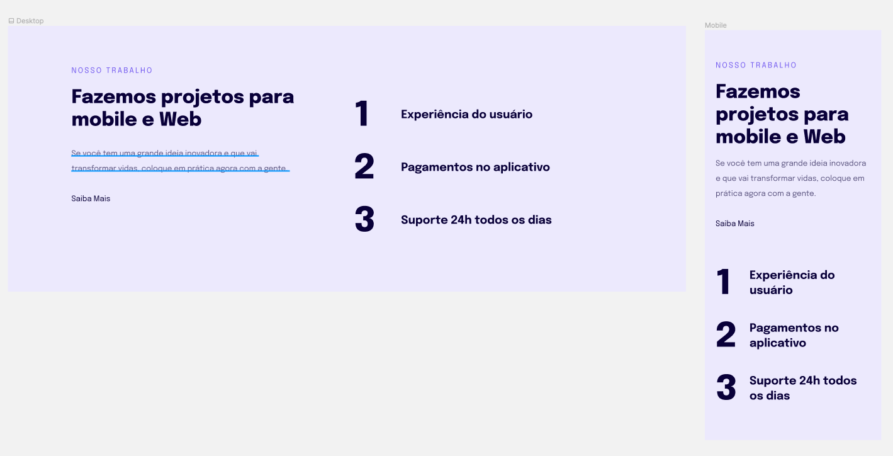

## 🖥️ Projeto

Essa é uma landing page responsiva de mobile e web.

## 🚀 Tecnologias

Esse projeto foi desenvolvido em aula da Rocketseat com as seguintes tecnologias:

- HTML
- CSS
- Git e Github